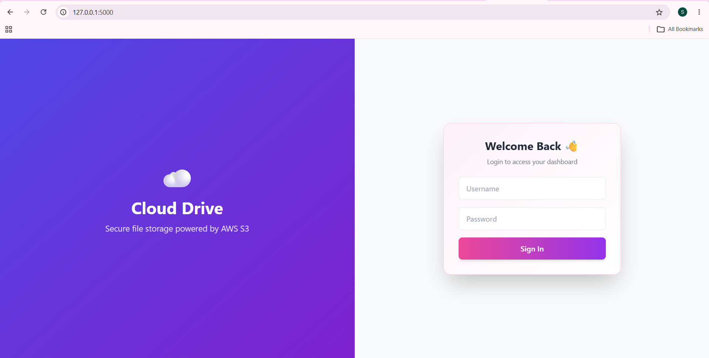
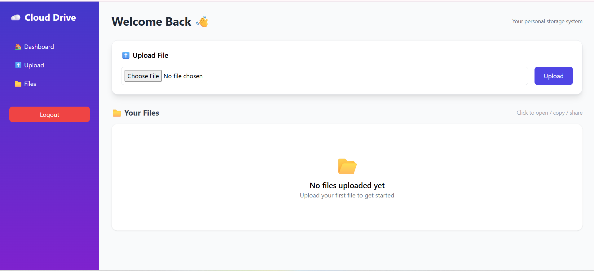
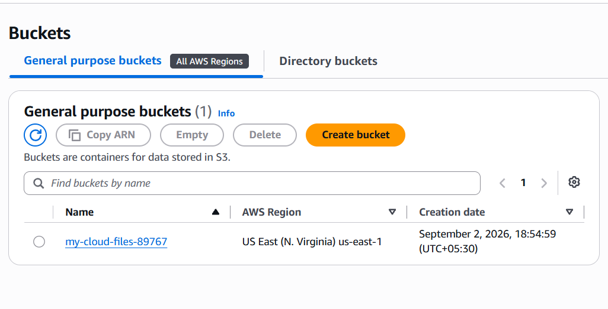

# CloudDrive ☁️

A secure, web-based cloud file storage application built with **Python Flask and AWS S3**.

CloudDrive allows users to upload, view, share, and manage files through a clean web dashboard, while Amazon S3 provides the underlying cloud storage.

This project demonstrates practical integration between a Python web application and AWS cloud infrastructure.

---

## 🚀 Features

* 🔐 **User Authentication** — Session-based login and logout
* 📤 **File Upload** — Upload files from the Flask application to Amazon S3
* 📁 **Dashboard** — View files stored in the connected S3 bucket
* 🔗 **Secure File Access** — Time-limited presigned URLs without making the S3 bucket public
* 📋 **Copy Links** — Copy secure file links with one click
* 📤 **Share Files** — Native browser sharing support where available
* ❌ **File Deletion** — Delete files directly from Amazon S3
* 🎨 **Responsive UI** — Dashboard built with HTML, JavaScript, and Tailwind CSS
* 🔒 **Environment-Based Configuration** — AWS and application credentials stored outside the source code

---

## 🏗️ Architecture

```text
                User
                 │
                 ▼
            Web Browser
                 │
                 ▼
        Flask Web Application
                 │
                 ▼
           Boto3 / AWS SDK
                 │
                 ▼
             Amazon S3
```

Flask handles routing, authentication sessions, and the web interface.

**Boto3** communicates with Amazon S3 to perform file operations such as:

* Uploading files
* Listing stored files
* Generating presigned URLs
* Deleting files

The S3 bucket remains private, while authenticated users receive temporary presigned URLs for file access.

---

## 🧰 Tech Stack

| Layer           | Technology                     |
| --------------- | ------------------------------ |
| Backend         | Python, Flask                  |
| Cloud Storage   | Amazon S3                      |
| AWS SDK         | Boto3                          |
| Frontend        | HTML, Tailwind CSS, JavaScript |
| Configuration   | python-dotenv                  |
| Version Control | Git, GitHub                    |

---

## 📂 Project Structure

```text
CloudDrive/
│
├── app.py
├── s3upload.py
├── requirements.txt
├── .gitignore
├── .env.example
│
├── templates/
│   ├── login.html
│   └── dashboard.html
│
├
│
├── screenshots/
│   ├── login.png
│   ├── dashboard.png
│   ├── dashboard-empty.png
│   └── s3-bucket.png
│
└── README.md
```

> **Note:** The actual `.env` file and `venv/` directory are excluded from GitHub using `.gitignore`.

---

## ⚙️ Setup & Installation

### 1. Clone the repository

```bash
git clone https://github.com/shwetabhakare51/CloudDrive.git
cd CloudDrive
```

### 2. Create a virtual environment

```bash
python -m venv venv
```

### 3. Activate the virtual environment

**Windows:**

```powershell
venv\Scripts\activate
```

**macOS/Linux:**

```bash
source venv/bin/activate
```

### 4. Install dependencies

```bash
pip install -r requirements.txt
```

### 5. Configure environment variables

Create a `.env` file in the project root.

```text
AWS_ACCESS_KEY_ID=your_key_here
AWS_SECRET_ACCESS_KEY=your_secret_here
AWS_REGION=your_aws_region
S3_BUCKET_NAME=your_bucket_name

SECRET_KEY=your_flask_secret_key

APP_USERNAME=your_username
APP_PASSWORD=your_password
```

**Never commit your `.env` file to GitHub.**

A `.env.example` file is included in the repository as a safe configuration template.

### 6. Run the application

```bash
python app.py
```

Then open:

```text
http://127.0.0.1:5000
```

---

## 🔒 Security

CloudDrive uses several security practices:

* AWS credentials are loaded through environment variables.
* Application login credentials are stored outside the source code.
* The S3 bucket can remain private with **Block Public Access enabled**.
* File access is provided through temporary presigned URLs.
* `.env` is excluded from Git version control.
* AWS credentials are never stored directly in the source code.

### Presigned URL Flow

```text
Authenticated User
       │
       ▼
Flask Application
       │
       ▼
Generate Presigned URL
       │
       ▼
Temporary S3 Access
       │
       ▼
User Views File
```

Presigned URLs in this project expire after **1 hour**.

---

## 📸 Screenshots

### 🔐 Login Page



### ☁️ Dashboard



### 📂 Empty Dashboard


### 🪣 AWS S3 Bucket



---

## 🎯 What This Project Demonstrates

This project demonstrates practical experience with:

* ☁️ AWS S3 cloud storage
* 🐍 Python and Flask backend development
* 🔧 Boto3 AWS SDK integration
* 🔐 Environment-based credential management
* 🔗 AWS S3 presigned URLs
* 📤 Cloud file upload and management
* 🗑️ Cloud object deletion
* 🌐 Web application development
* 🏗️ Integration between application and cloud infrastructure
* 🐙 Git and GitHub version control

---

## 🔮 Future Improvements

Possible future enhancements include:

* User-specific file isolation
* File size and extension validation
* Multiple-file uploads
* Folder support
* File search and filtering
* Docker containerization
* CI/CD pipeline
* Terraform-based AWS infrastructure
* Deployment to AWS EC2

---

## 👤 Author

**Shweta Bhakare**

[GitHub](https://github.com/shwetabhakare51)
